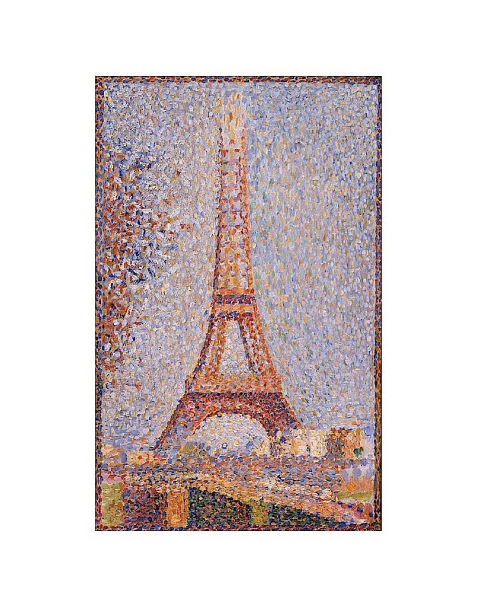
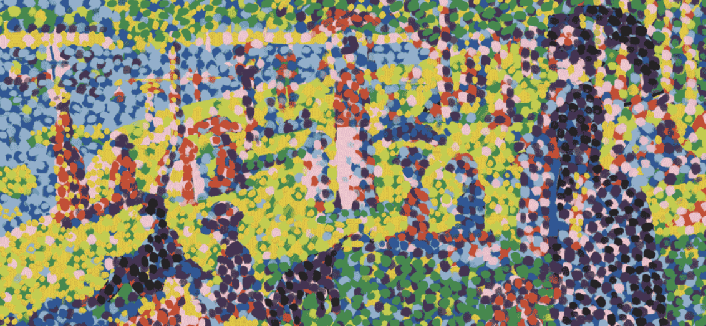
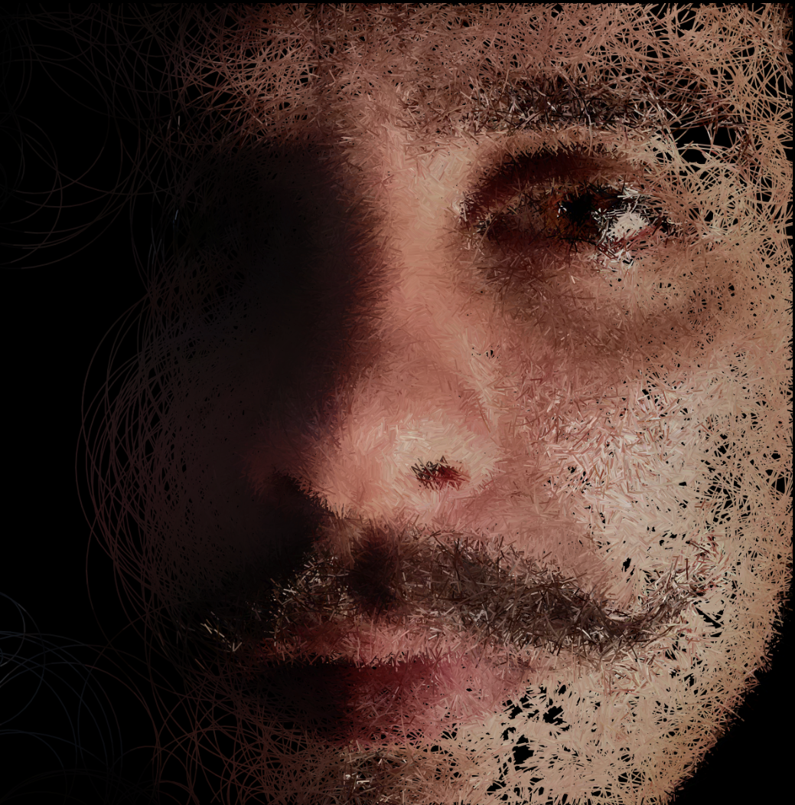
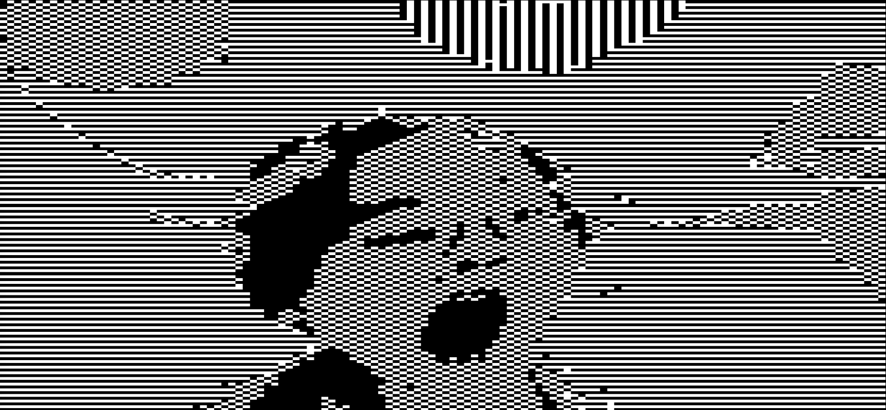
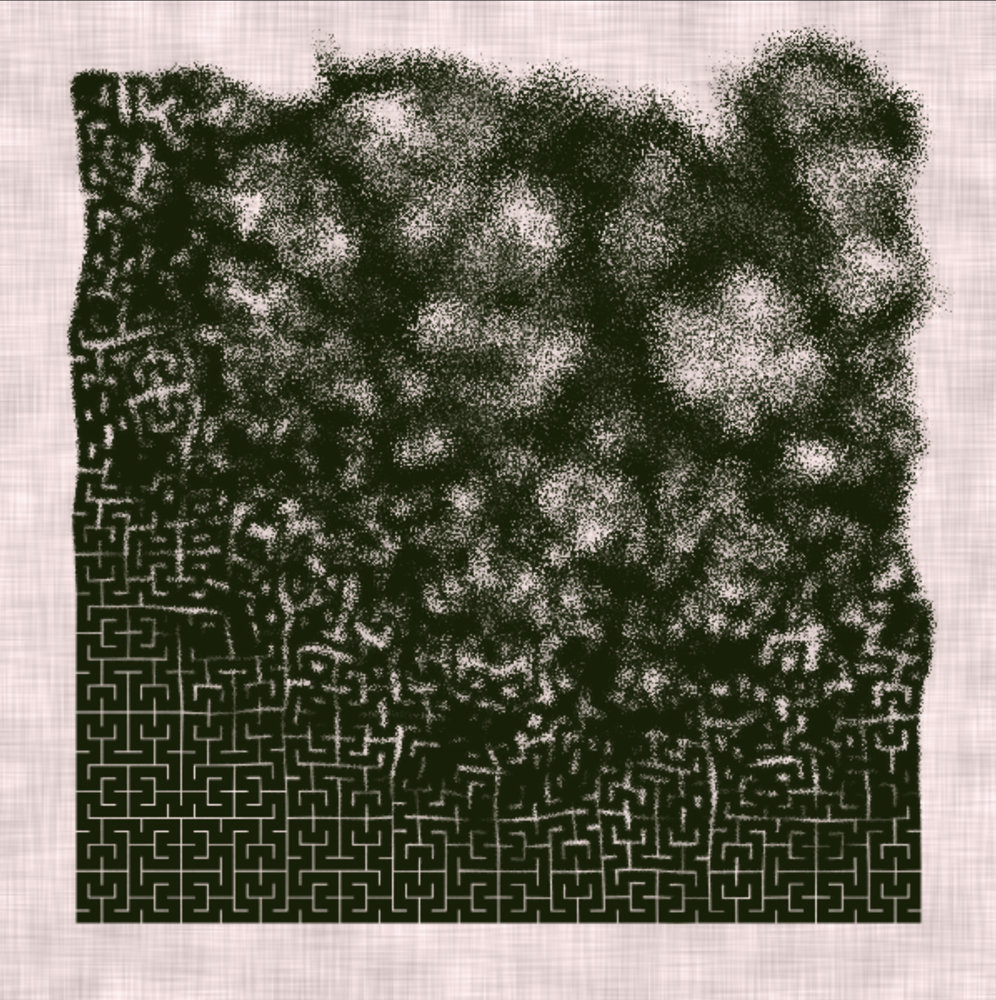

# IDEA9013 Creative Coding Quiz 8  
Yera Yan (yyan0431)

---

## Part 1: Imaging Technique Inspiration

**Georges Seurat**, a French painter of the Pointillist school and a representative of Post-Impressionism. I have selected two of his works, *A Sunday on La Grande Jatte* and *Eiffel Tower*, in which Seurat uses a myriad of tiny brushstrokes and high-contrast blocks of colour. This has a lot in common with digital art, which we can think of as a pile of pixels or particles that can be reconstructed and animated. This Google Doodle drawn in honour of Seurat (2.12.2021) is also very inspirational.

#### Selected Works:
1. *A Sunday on La Grande Jatte*

   

2. *Eiffel Tower*

   

3. *Google Doodle* (2.12.2021)

   
   [Google doodle of Georges Seurat’s 162nd Birthday](https://web.archive.org/web/20220321071812/http://www.google.com/doodles/georges-seurats-162nd-birthday)

---

## Part 2: Coding Technique Exploration

Here are 3 examples that inspired me:

1. **Circular random walker**  
   The slow process of composing an image with a random walker is enjoyable, especially as it gives it a brushstroke-like texture and is reminiscent of a painter's process of drawing an image.

   
   [Image Circular Random Walker by Vamoss](https://openprocessing.org/sketch/624879)

2. **Glitch/Pixel**  
   The original work uses a camera to display the image. I think colour could also be added to make this style work for colourful paintings—like pointillism—where the user can interactively control the size of the pointillist strokes (i.e., the pixels) and make them dynamic.

   
   [BLACK OUT by Zaron Chen](https://openprocessing.org/sketch/2136720)

3. **Particles/Noise**  
   This random movement of particles following the mouse also applies to pixelated paintings.

   
   [Hilbert by Zaron Chen](https://openprocessing.org/sketch/2136720)
